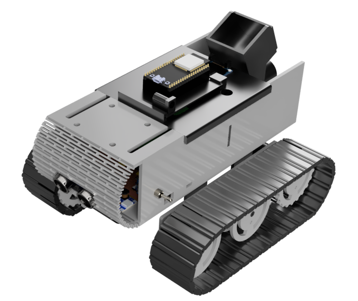

# JAV²

## JAV² Tree Planting Vehicle

The JAV² Tree Planting Vehicle is inspired by the [#teamtrees](https://teamtrees.org/) initiative to plant 20 million trees before 2020. Hence, we created a Tracked Vehicle that can travel through uneven terrain to plant seeds so that they can turn into trees. The JAV² Tree Planting Vehicle is designed to be controlled through Wifi with a mobile device to enable it to plant the seeds in remote areas.

## Table of Contents

- [Documentation](#documentation)
- [Features](#features)
- [Setup](#setup)
- [What You Will Need](#what-you-will-need)
- [Contributors](#contributors)

## Documentation

Documentations for JAV² can be found on GitHub Pages at [https://hamtamsp.github.io/JAV2/documentation](https://hamtamsp.github.io/JAV2/documentation) .

## Features

- Wireless Connectivity with Wifi.
- Auto Seed Dispensing
- Travel on Uneven Terrain

## What You Will Need

- JAV² Tree Planting Vehicle
- Seeds

## Setup

Fill Up the Hopper with Seeds.

Turn on the Tree Planting Vehicle by using the power switch located on the right side of the robot.

Connect to the Wireless AP on the ESP32 using the details on the OLED Screen.

Follow the instructions on the OLED Screen and Enter your wireless network credentials.

Connect to your wireless network and use the details on the OLED Screen to control the Tree Planting Vehicle.

## Contributors

Contributors to JAV² are listed here in alphabetical order. More detailed information about contributions can be found using the [git-commit history](https://github.com/hamtamSP/JAV2/commits/master) of the main branch.

- [@Darkmidget](https://github.com/Darkmidget) (Vincent Ho)
- [@DsouzaVirgil](https://github.com/DsouzaVirgil) (Virgil)
- [@hamtamSP](https://github.com/hamtamSP) (Arian Yap)
- [@JerenTong](https://github.com/JerenTong) (Jeren Tong)
